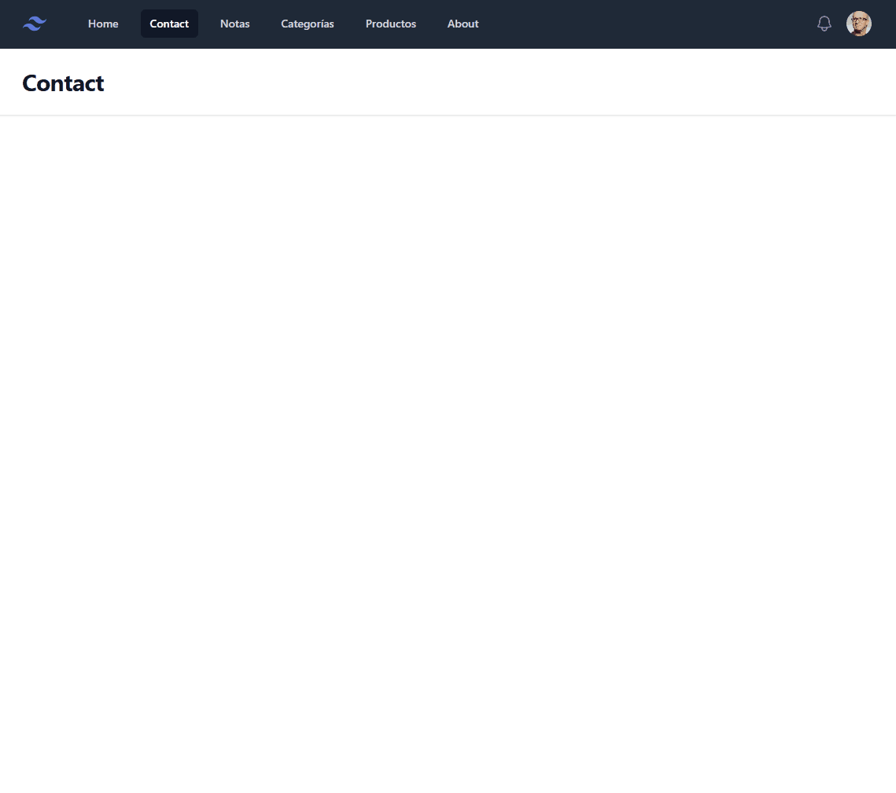

# Tarea Recuperación 1ª Evaluación. Temas 1,2,3,4 y 5

Esta es la tarea que deben realizar los alumnos que no han superado la primera evaluación. 

- La tarea es una continuación del examen de los temas 4,5 (que incluye también los temas 1,2,3).
- Para poder recuperar la evaluación, es necesario completar la tarea con una puntuación mínima de 7 puntos.
- Además, tendrán que superar un pequeño examen práctico presencial en la fecha que se determine.

Para resolver esta tarea tenéis disponile la solución al examen de la 1ª evaluación en el siguiente enlace: [Solución examen 1ª evaluación](https://github.com/jssdocente/2425_DWES/tree/main/Exam/T45).

El punto de partida es vuestra tarea **UT4/webapp**.

### 📚 Instrucciones

- Copiar vuestra tarea **UT4/webapp** en una nueva carpeta dentro de vuestro repositorio. Carpeta `Exam/1Eval/ter-webapp`.
- Crear un enlace para `Laravel Herd`, desde la línea de comandos, desde la carpeta `Exam/1Eval/ter-webapp` y ejecutar el comando `herd link terwebapp`, para poder acceder a la aplicación desde la URL `https://terwebapp.test`.
- La BD de la aplicación está en el fichero `_bd_/db.sqlite` (⚡ Recuerda revincular la Fuente de Datos en PHPStorm para visualizar esta BD).
- Las signas `TER` significan `TAREA EVALUABLE RECUPERACIÓN`.

### 📦 Recursos

**Generales**

  - [Solución examen 1ª evaluación](https://github.com/jssdocente/2425_DWES/tree/main/Exam/T45)
  - [TailwindCSS](https://tailwindcss.com)
  - [Episodios Tarea WebApp (Todos los episodios de la tarea de la WebApp)](https://drive.google.com/drive/folders/1WOfmBEt9tPEkfnOs2F41SHsrzXUIfNTz?usp=sharing)

**Plantillas para las páginas listado y detalle**

  - [Plantillas para la página listado](./_res/code/plantilla_lista.html)
  - [Plantillas para la página detalle](./_res/code/plantilla_detalle.html)

### Ejercicio No-puntuaable (pero obligatorio. Sin este ejercicio no se evaluará la tarea)

**La tarea debe incluir el ejercicio del examen (la solución del examen la tenéis disponible), es decir, la creación de un CRUD para los productos**

Crear un CRUD para un tabla de productos

- Página visualizar lista de productos.
- Página para añadir un producto.
- Página para visualizar un producto y eliminar un producto.

Para su desarrollo, aplicar lo vista en clase, con las buenas prácticas y convenciones de nombres utilizadas durante el curso.

Visualizar una lista de productos, según la imagen que se acompaña.

📦 SQL:

```sql
create table Products
(
    id       INTEGER not null
        primary key autoincrement,
    name     TEXT    not null,
    category TEXT    not null
);
```

Lista de productos para trabajar:
  
```sql
INSERT INTO Products (id, name, category) VALUES (1, 'Chai', 'Beverages');
INSERT INTO Products (id, name, category) VALUES (2, 'Chang', 'Beverages');
INSERT INTO Products (id, name, category) VALUES (3, 'Aniseed Syrup', 'Condiments');
INSERT INTO Products (id, name, category) VALUES (7, 'Uncle Bob''s Organic Dried Pears', 'Produce');
INSERT INTO Products (id, name, category) VALUES (8, 'Northwoods Cranberry Sauce', 'Condiments');
INSERT INTO Products (id, name, category) VALUES (9, 'Mishi Kobe Niku', 'Meat/Poultry');
INSERT INTO Products (id, name, category) VALUES (10, 'Ikura', 'Seafood');
INSERT INTO Products (id, name, category) VALUES (11, 'Queso Cabrales', 'Dairy Products');
INSERT INTO Products (id, name, category) VALUES (12, 'Queso Manchego La Pastora', 'Dairy Products');
INSERT INTO Products (id, name, category) VALUES (13, 'Konbu', 'Seafood');
```	


### Ejercicio 1 (5 puntos)

Crear un CRUD para tabla `Categories`

- Página visualizar lista de categorías.
- Página para añadir una categoría.
- Página para editar y eliminar una categoría.
- Página para visualizar un categoría.

Para su desarrollo, aplicar lo vista en clase, con las buenas prácticas y convenciones de nombres utilizadas durante el curso.

📦 SQL:

```sql
create table Categories
(
    id          INTEGER
        primary key autoincrement,
    name        TEXT,
    description TEXT
);
```

Lista de productos para trabajar:
  
```sql
NSERT INTO Categories (id, name, description) VALUES (1, 'Beverages', 'Soft drinks, coffees, teas, beers, and ales');
INSERT INTO Categories (id, name, description) VALUES (2, 'Condiments', 'Sweet and savory sauces, relishes, spreads, and seasonings');
INSERT INTO Categories (id, name, description) VALUES (3, 'Confections', 'Desserts, candies, and sweet breads');
INSERT INTO Categories (id, name, description) VALUES (4, 'Dairy Products', 'Cheeses');
INSERT INTO Categories (id, name, description) VALUES (5, 'Grains/Cereals', 'Breads, crackers, pasta, and cereal');
INSERT INTO Categories (id, name, description) VALUES (6, 'Meat/Poultry', 'Prepared meats');
INSERT INTO Categories (id, name, description) VALUES (7, 'Produce', 'Dried fruit and bean curd');
INSERT INTO Categories (id, name, description) VALUES (8, 'Seafood', 'Seaweed and fish');
```	

**Validaciones**

- Los campos `name` y `description` son obligatorios.
- El campo description debe ser mayor de 5 y menor de 100 caracteres.


**Resultado**

El resultado final debe ser muy similar al siguiente video:




### Ejercicio 2 (5 puntos)

Crear un CRUD para un tabla de `Empleados`

- Página visualizar lista de empleados.
- Página para añadir un empleado.
- Página para editar y eliminar un empleado.
- Página para visualizar un empleado.

Para su desarrollo, aplicar lo vista en clase, con las buenas prácticas y convenciones de nombres utilizadas durante el curso.

📦 SQL:

```sql
create table Employees
(
    id          INTEGER
      primary key autoincrement,
    name        TEXT,
    address     TEXT,
    city        TEXT,
    postal_code TEXT,
    phone       TEXT
);
```

Lista de empleados para trabajar:
  
```sql
INSERT INTO Employees (id, name, address, city, postal_code, phone) VALUES (1, 'Juan', '507 - 20th Ave. E.Apt. 2A', 'Seattle', '98122', '(206) 555-9857');
INSERT INTO Employees (id, name, address, city, postal_code, phone) VALUES (2, 'Alberto', '908 W. Capital Way', 'Tacoma', '98401', '(206) 555-9482');
INSERT INTO Employees (id, name, address, city, postal_code, phone) VALUES (3, 'Pedro', '722 Moss Bay Blvd.', 'Kirkland', '98033', '(206) 555-3412');
INSERT INTO Employees (id, name, address, city, postal_code, phone) VALUES (4, 'Damian', '4110 Old Redmond Rd.', 'Redmond', '98052', '(206) 555-8122');
INSERT INTO Employees (id, name, address, city, postal_code, phone) VALUES (5, 'Roberto', '14 Garrett Hill', 'London', '98052', '(71) 555-4848');
INSERT INTO Employees (id, name, address, city, postal_code, phone) VALUES (6, 'Ignacio', '14 Garrett Hill', 'London', '98033', '(71) 555-7773');
INSERT INTO Employees (id, name, address, city, postal_code, phone) VALUES (7, 'Marina', '14 Garrett Hill', 'London', '98033', '(71) 555-5598');
INSERT INTO Employees (id, name, address, city, postal_code, phone) VALUES (8, 'Isidoro', '14 Garrett Hill', 'London', '98401', '(206) 555-1189');
INSERT INTO Employees (id, name, address, city, postal_code, phone) VALUES (9, 'Miguel', '15 Garrett Hill', 'London', '98401', '(71) 555-4444');
```	

**Validaciones**

- Los campos `name`, `address`, `city`, `postal_code` y `phone` son obligatorios.
- La dirección no puede ser menor de 10 ni mayor de 150 caracteres.
- La ciudad no puede ser menor de 5 ni mayor de 50 caracteres.
- El código postal no puede ser menor de 5 ni mayor de 10 caracteres.
- El teléfono no puede ser menor de 9 ni mayor de 20 caracteres.


**Resultado**

El resultado final debe ser muy similar al siguiente video:


### Rúbrica de Evaluación

(Esta rúbrica se aplica a cada uno de los ejercicios, esta nota calculada se multiplicará por 0.5 para obtener la nota final de la tarea).

| Apartado               | Descripcion                                                  | Puntos        |
| ---------------------- | ------------------------------------------------------------ | ------------- |
| Funcionalidad básica   | Muestra el listado de productos                              | +1 punto      |
|                        | Muestra listado de productos y creación                      | +1 punto      |
|                        | Muestra el detalle del producto                              | +1 punto      |
|                        | Muestra la validación al crear/actualizar un producto        | +1 punto      |
| Funcionalidad avanzada | Aplica la validación, manteniendo los datos en el formulario | +1 punto      |
|                        | Permite la eliminación de un producto                        | +1.5 punto    |
|                        | Permite la actualización de un producto                      | +1.5 punto    |
|                        | El diseño visual se adecua al diseño planteado por elrofesor | +2 punto      |
| Total                  |                                                              | **10 puntos** |


Para aprobar es necesario que la aplicación sea completamente funcional, mostrando al menos las siguientes pantallas:

- Listado de productos, de detalle de un producto, crear y eliminar un producto.
- Listado de categorías, de detalle de una categoría, crear y eliminar una categoría.
- Listado de empleados, de detalle de un empleado, crear y eliminar un empleado.


🔥🔥 **Para poder aprobar la tarea, el alumno debe obtener una nota mínima de 7 puntos en el total de la tarea.**