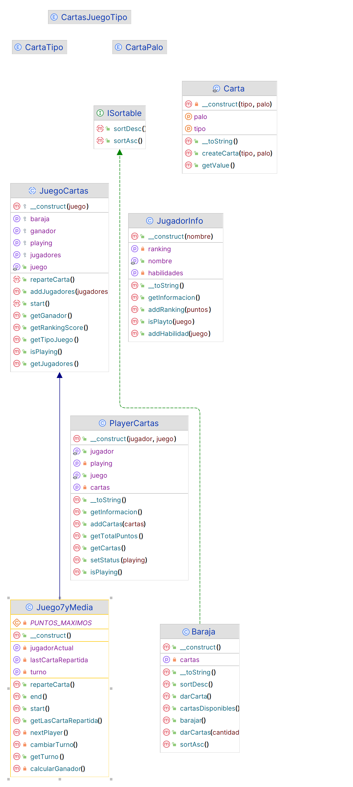

# 03.3 Ejercicios avanzados POO con PHP

Estos ejercicios están pensados para que puedas practicar y afianzar los conocimientos adquiridos en el tema de POO.

### 🎯 Objetivos

- Trabajar y ver todas las posibilidades de los Enumerados en PHP.
- Aplicar Herencia y Composición de manera conjunta.
- Aplicar técnicas avanzadas con Objetos en PHP.

### ✏️ Entrega

Normas de entrega:

- Se guardarán dentro de la estructura de carpetas del tema `UT3`, carpeta ejercicios `EC`y `03`. En la ruta `UT3\EC\03\`.
- Cada ejericio se entregará en un archivo independiente, con el nombre que se indique en cada ejercicios.
- No es necesario entregarlos como tarea, pero si es necesario realizarlos, y se preguntarán aleatoriamente en clase.


### 👉 Recursos

Para facilitar la realización del ejercicio se adjunta al final un Anexo con el [diagrama de clases](#diagramas-de-clases) de la jerarquía de clases de animales. Este diagrama es completo, una vez realizado todos los ejercicios de esta hoja.

## Ejercicios Bloque 3.

### Ejercicio 301

nombre-fichero: `03.301_Ejercicio.php`

> **Crea un enum con nombre `CartasJuegoTipoEm` que contenga los siguientes juegos de cartas españoles:**
    
   - SOLITARIO = 1
   - _7YMEDIA = 2
   - BRISCA = 3
   - ESCOBA = 4
   - MUS = 5
   - CHINCHON = 6


Vamos a realizar una baraja de cartas españolas con POO.

> **A. Crea una clase Enumerado CartaTipo de tipo `int` con las siguientes constantes:**

  - REY = 12
  - CABALLO = 11
  - SOTA = 10
  - SIETE = 7
  - SEIS = 6
  - CINCO = 5
  - CUATRO = 4
  - TRES = 3
  - DOS = 2
  - AS = 1

> **B. Crea una clase `enum` CartaPalo de tipo `int` con las siguientes constantes:**

  - OROS = 1
  - COPAS = 2
  - ESPADAS = 3
  - BASTOS = 4


> **C. Crea una clase `Carta` que tenga dos propiedades privadas, tipo (CartaTipo), palo (CartaPalo) e imagen (string).**

  - Esta clase tendrá un constructor privado que reciba como parámetros el tipo y el palo de la carta.
  - Para poder construir cartas se utilizará un patrón FactoryMethod, creando un método `crearCarta` estático que reciba como parámetros el tipo y el palo de la carta, y devuelva una instancia de la clase. (para su implementación utiliza un método estático).
  - Será inmutable, es decir, una vez creada, no se podrá modificar sus propiedades (atributos públicos solo lectura).
  - agregar un método `__toString()` que devuelva el nombre de la carta (por ejemplo: "Rey de Oros").
  - agregar un método `getValue()` que devuelva el valor de la carta (por ejemplo: 12).

> **D. Crea una interface `ISortable` con los métodos `sortAsc` y `sortDesc`.**

> **E. Crea una clase `Baraja` que contenga las 40 cartas de la baraja española, en un array de cartas.**

  En el constructor crea las 40 cartas, utilizado forech para recorrer los palos y los tipos de cartas. (Enum::cases()).

  Tendrá los siguientes métodos:
  - `barajar`: ordenará aleatoriamente las cartas de la baraja (sin devolver nada).
  - `darCarta`: devolverá la siguiente carta de la baraja, y la eliminará de la baraja. (La primera carta). Utiliza el método `array_shift` para eliminar la primera carta.
  - `darCartas`: devolverá un número de cartas pasado como parámetro, y las eliminará de la baraja. Utiliza el método `darCarta` para obtener las cartas.
  - `cartasDisponibles`: devolverá el número de cartas que quedan en la baraja.

  Implementará la interface `ISortable` con los métodos `sortAsc` y `sortDesc` que ordenarán las cartas de la baraja de forma ascendente y descendente respectivamente. Utiliza el método `usort` para ordenar las cartas, y el operador `spaceship` para comparar las cartas. (operador de comparación de PHP).


> **F. Crea una clase `JugadorInfo` en base a los siguiente requerimientos:**
      
  - Tendrá un nombre, un Ranking (puntos) y un habilidad (lista de los juegos que sabe jugar).
  - En el constructor se le pasará solamente el nombre, y el resto de propiedades se inicializarán a 0 o vacías.

  Métodos:
  - addRanking: que sumará puntos al ranking.
  - addHabilidad: que añadirá un juego a la lista de habilidades.
  - isPlayto: que devolverá si el jugador sabe jugar a un juego pasado como parámetro.
  - __toString: que devolverá el nombre del jugador.

> **G. Crea una clase `PlayerCartas` que contenga información del Jugador a través de la clase `JugadorInfo`. Esta clase se utiliza para cuando un jugador juega a un juego de cartas**

  - Tendrá un JugadorInfo.
  - Tendrá el tipo del juego (CartasJuegoTipo).
  - Propiedad `getName` que devolverá el nombre del jugador. El nombre del jugador lo obtendrá del JugadorInfo (propiedad `jugador`)
  - Tenga un estado de si está jugando o no, para cambiar el estado `setStatus(bool $playing)` y `isPlaying`.

  Métodos:
  - `addCartas`: que aceptará un números indefinido de cartas y las añadirá al jugador. (operador variadics)
  - `getCartas`: que devolverá las cartas del jugador.
  - `getTotalPuntos`: que devolverá la suma de los puntos de las cartas del jugador.
  - `__toString`: que devolverá el nombre del jugador, su ranking y sus habilidades, y las cartas que tiene.
  
> **H. Crea una clase `JuegoCartas` (no instanciable) que sea la clase base, y que tenga los :**

  Atributos/Propiedades:
  - juego (tipo de juego). No público y solo lectura.
  - baraja (privada). No pública
  - ganador (privado). No público y permite null.

  Métodos
  - `addJugadores(PlayerCartas ...$jugadores)`: que añadirá jugadores al juego. Comprobará que todos los jugadores sean del mismo tipo de juego. Si no lo son, lanzará una excepción.
  - `reparteCarta`: que será abstracto (debe ser implementado en las clases hijas).
  - `getLasCartaRepartida`: que devolverá la última carta repartida.
  - `getTurno`: que devolverá el jugador que tiene el turno.
  - `getGanador`: que devolverá el jugador que ha ganado la partida.
  - `getJugadores`: que devolverá un array con los jugadores.
  - `isPlaying`: que devolverá si el juego está en curso o no.
  - `start`: abstracto. Iniciará el juego.
  - `end`: abstracto. Obtiene el ganador y cambia a finalizado el juego.
  - `getRankingScore`: que devolverá un array con los jugadores ordenados por puntos decrecientes.
  
  Crea los atributos necesarios para implementar los métodos anteriores.

> **I. Crea una clase  `Juego7yMedio` que herede de `JuegoCartas` y que aplique la siguiente lógica de juego:**

  Funciones privadas:
  - `nextPlayer`: que pasará el turno al siguiente jugador. Si el jugador actual es el último, retornará null.
  - `calcularGanador`: que calculará el ganador de la partida, y asignará el valor al atributo `$ganador`.
  - `cambiarTurno`: que cambiará el turno al siguiente jugador, y asignará el valor al atributo `$jugadorActual`.
  - `getTurno`: que devolverá el jugador que tiene el turno.
  - `reparteCarta`: reparte carta al jugador que tiene el turno, si se pasa de 7.5 puntos pasará el turno al siguiente jugador. Si el turno-actual es null, se llamará al método `end`.
  - `start`: indica juego está en curso, inicializa la baraja, baraja las cartas, y asigna el turno al primer jugador
  - `end`: indica que el juego está finalizado, y calcula el ganador.

  Módo de funcionamiento:
  - Comiezan el juego en método `start` (inicializa la baraja, baraja las cartas, y asigna el turno al primer jugador).
  -  Reparte carta al jugador que tenga el turno.
  -  Si el jugador se pasa de 7 y medio, pasa el turno al siguiente jugador.
  - El juego seguirá hasta que todos los jugadores hayan jugado.<br>
  - Ganará el Jugador que más se acerque a 7 y medio (todos se han pasado, gana el que menos se haya pasado).<br>
  - El juego estará procesando hasta que se finalice el juego. Una vez finalizado debe haber un ganador.


### Ejercicio 302

> nombre-fichero: `03.302_SieteYMedia.php`

En base a toda la estructura del ejercicio 301, crea una pequeño programa que simule el juego de las 7 y media.<br>
Crea en la simulación al menos 3 jugadores.<br>

Cada vez que se llame a la página, iniciará una nueva partida, y obtendrá el número de jugadores de un parámetro GET["players"], en caso de no existir, se tomará 3 jugadores por defecto.<br>
Los jugadores se crearán con un nombre aleatorio.

El juego mostrará en pantalla la evolución de la partida, y al finalizar mostrará el ganador.

Ej:

Comienza la partida.
- Jugador 1 (nombre): Reparte carta `Rey de Oros` (total: 3).
- Jugador 1 (nombre): Reparte carta `Caballo de Copas` (total: 6).
- Jugador 1 (nombre): Reparte carta `Sota de Espadas` (total: 9.5).  

Siguiente jugador... (nombre)
- Jugador 2 (nombre): Reparte carta ...
- Jugador 2 (nombre): Reparte carta ...

Siguiente jugador... (nombre)
- Jugador 3 (nombre): Reparte carta ...
- Jugador 3 (nombre): Reparte carta ...
- Jugador 3 (nombre): Reparte carta ...

Ha ganado el Jugador 1 (nombre) con un total de 7.5 puntos.

Ranking de la partida

1. Jugador 3 (nombre) - 5.5 puntos
2. Jugador 2 (nombre) - 6.5 puntos
3. Jugador 1 (nombre) - 7.5 puntos
...


Para que os sirva de guía, os dejo la página web que implementa el juego.

```php	
<?php
$player1 = new PlayerCartas(new JugadorInfo("Javier"), CartasJuegoTipo::_7YMEDIA);
$player2 = new PlayerCartas(new JugadorInfo("Manolo"), CartasJuegoTipo::_7YMEDIA);
$player3 = new PlayerCartas(new JugadorInfo("Pedro"), CartasJuegoTipo::_7YMEDIA);

$juego = new Juego7yMedia();
$juego->addJugadores($player1, $player2, $player3);

$juego->start();


?>

<!doctype html>
<html lang="en">
<head>
    <meta charset="UTF-8">
    <title>Siete y media</title>
</head>
<body>
<h2>Comienza la partida. Juego de las SieteYMedia</h2>
<h4>Empieza jugador: <?= $juego->getTurno()?->jugador->nombre ?? "turno desconocido"; ?></h4>

<?php
do {

    $jugadorTurno = $juego->getTurno();
    do {
        $juego->reparteCarta();
        $carta = $juego->getLasCartaRepartida();
        if ($carta) {
            echo "<p>Jugador {$juego->getTurno()}: carta repartida: {$carta} ({$carta->getValue()}) puntos </p>";
        }

    } while ($juego->getTurno() === $jugadorTurno);

    if ($juego->isPlaying()) {
        echo "<h4>Siguiente turno: {$juego->getTurno()} ... </h4>";
    }

} while ($juego->isPlaying())
?>

<h3>Ha ganado el jugador: <?= $juego->getGanador() ?></h3>
<br>
<h2>Ranking de la partida</h2>
<ul>
    <?php foreach ($juego->getRankingScore() as $player) : ?>
        <li><?= $player->jugador->nombre ?>: <?= $player->getTotalPuntos() ?> puntos</li>
    <?php endforeach; ?>
</ul>
</body>
</html>
```	


### Anexo 

#### Diagramas de clases

