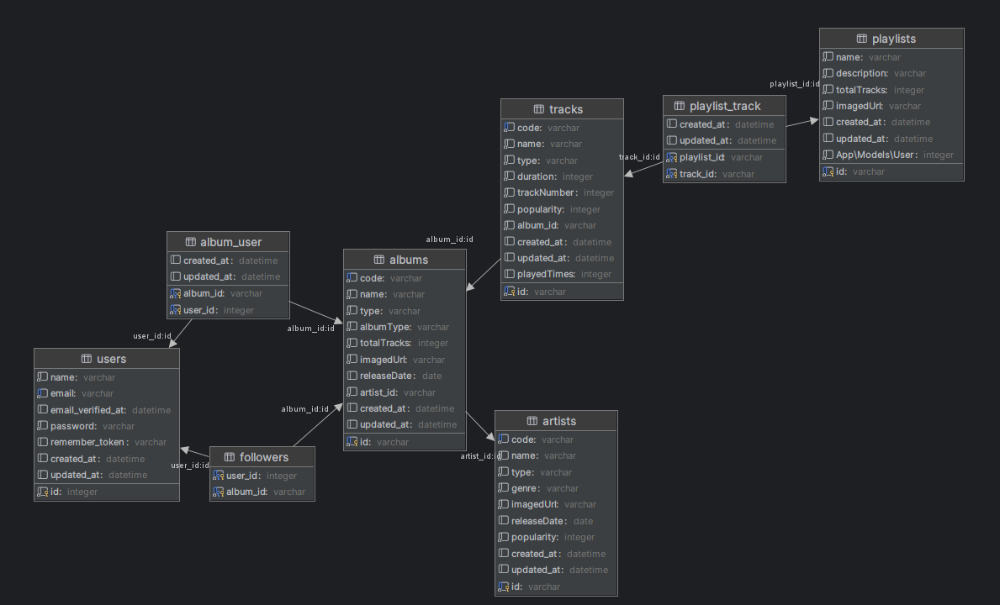
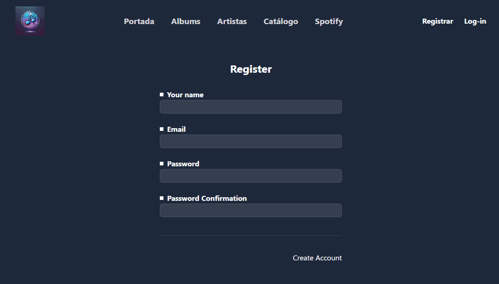
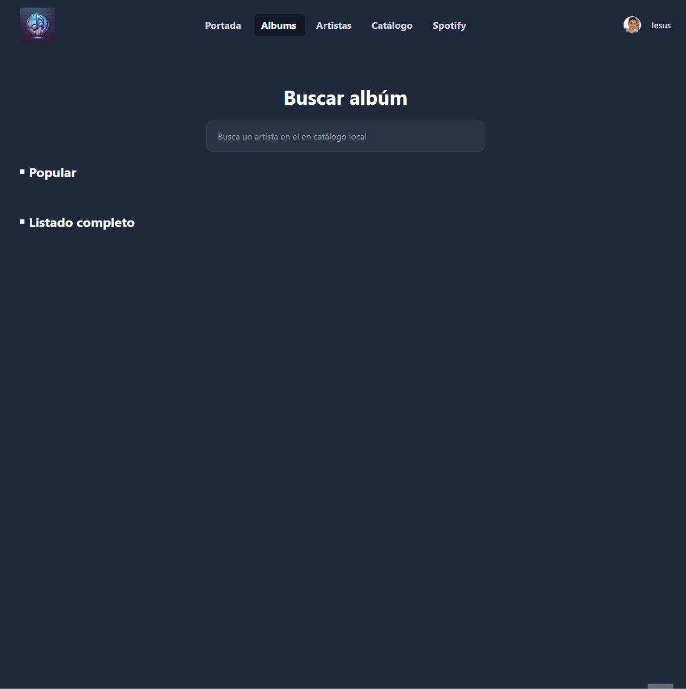
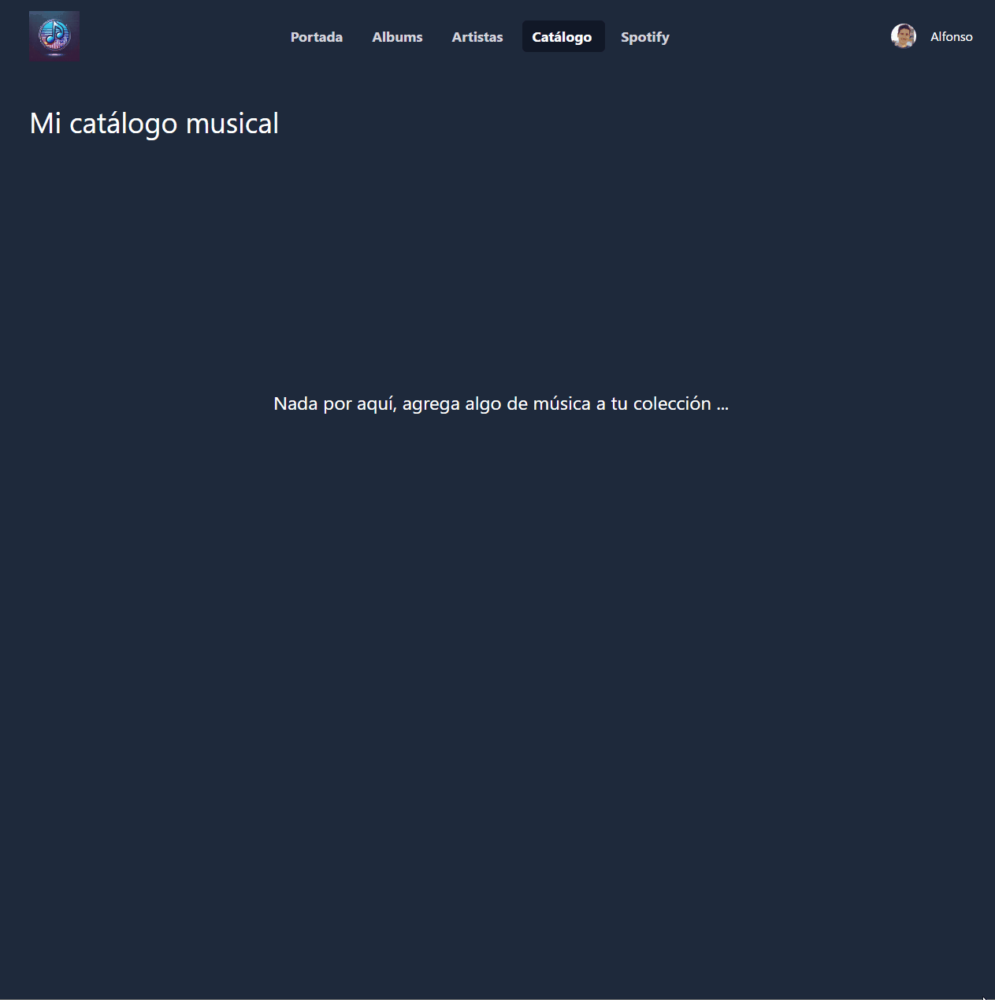

# Tarea Evaluable: Laravel y API Rest.  MUSIFY

Esta tarea evaluable consiste en la creación de una página web para crear un catálogo musical global, obtenido las canciones y albumes de Spotify, y donde los usuarios pueden agregar un albúm o artista al catálogo global y a su propio catálogo musical.
El objetivo además es crear una parte social, donde se muestren las albúmes, artistas y canciones más populares, bien a través de Likes o por número de reproduciones, a número de seguidores.

## Requisitos

### Requisitos Funcionamiento

Las principales funcionalidades que debe tener la aplicación son:

**Páginas que debe tener la aplicación**

- Página de inicio, con información general
- Página de Albumes y detalle de un Albúm
- Página de Artistas, y detalle de un Artistas
- Página del catálogo musical de un usuario, con secciones como Albumes y Artistas.
- Página de Registro y Login de usuarios

**Detalle de la funcionalidad de cada página**

- Página de inicio
  -  Albumes más recientes agregados a la base de datos
  -  Albumes más populares (mas popularidad)
  -  Artistas más recientes agregados a la base de datos
  -  Artistas más populares (más popularidad)
  -  Canciones más recientes agregadas a la base de datos
  -  Canciones más escuchadas (número de reproduciones)

- Página de Albumes
  - Tendrá un buscador
  - Los albumnes se mostrarán
    - Popular: más populares (máximo 5)
    - Listado completo: todos los albúmes
  - Al hacer click sobre un Album, se mostrará su detalle, incluyendo las canciones del album

- Página de Artistas
  - Tendrá un buscador
  - Los artistas se mostrarán
    - Popular: más populares (máximo 5)
    - Listado completo: todos los artistas
  - Los albumnes se mostrarán ordenados por nombre del artista
  - Al hacer click sobre un Artista, se mostrará su detalle, incluyendo sus albúmes

- Página del catálogo musical de un usuario
  - Tendrá las siguientes secciones
    - Albumes más recientes: últimos agregados primero (máximo 5)
    - Artistas más recientes: últimos agregados primero (máximo 5)
    - Albums: Listado completo de todos los albums
    - Artistas: Listado completo de todos los artistas
  
  - Se podrá eliminar albumes y artistas. (PROYECTO EXTRA)

- Página Spotify
  Página para buscar música en la plataforma Spotify. Habrá un buscador, y se podrá buscar por Albumes o Artistas.
  - Al buscar, se buscará por 2 conceptos, albúms y artistas. (ya dado proyecto base)
  - Tendrá las siguientes secciones
    - Featuring: Albumes más populares (4)
    - Artitas: Todos los artistas de la búsqueda.
    - Albúms: Todos los albúms de la búsqueda.
  - Opciones:
    - Cada album y artista, al hacer click sobre la imagen, el detalle de un Albúm o artista. Desde ese detalle, se podrá agregar el albúmm o artista a la BD.
    - Detalle albúm: Se muestra su foto, nombre albúm y todas sus canciones
    - Detalle artista: Se muestra su nombre y todas sus albumes.

- Registro / Login de usuarios
  - Se podrá registrar un usuario
  - Se podrá loguear un usuario
  - Se podrá cerrar sesión
 
**Permisos**

- Invitados:
  - Ver portada
  - Ver albúms página, pero no detalle.
  - Ver artistas página, pero no detalle.
  - No puede ver página Spotify.
- Logados
  - Usuario: 
    - Puede visualizar todo.
    - Puede agregar un albúm o artista a su colección. (Si el albúm o artista no existen en catálogo global, se deben agregar al catálogo primero)
    - Puede agregar un albúm o artista desde Spotify a su colección y al catálogo global.
  - Administrador (PROYECTO EXTRA)
    - Elimimar un album del catálogo global, automáticamente eliminarlo de todos los usuarios que lo tengan.
    - Elimimar un artista del catálogo global, automáticamente eliminarlo de todos los usuarios que lo tengan.


### Requisitos Laravel

- Se deben utilizar Controladores.
- Se deben utilizar Middleware.
- Se deben utilizar componentes, al menos para los elementos:
  - Tarjeta Albúm y/o Artista (pueden ser la misma o distinta)
  - Mostrar línea de una Canción/Track
  - Mostrar línea de una Canción/Track con imagen
- Persnalizar página de Error 500
- Personalizar página de Error 404
- [Utilizar Excepciones (si es necesario)](https://jssdocente.github.io/dwes2425d/temas/08/22.Manejando-excepciones.html)
- Utilizar logging, para registrar las acciones.


## Recursos

Para la elaboración de este proyecto, se adjuntan los siguientes recursos:

Proyecto Guía

- [Los videos 27,28,29 y 30 de este curso](https://laracasts.com/series/30-days-to-learn-laravel-27)

Videos

- [Curso laravel 11 para principiantes](https://laraveldaily.com/course/laravel-beginners)
- [Aprendible: Curso laravel 11 desde cero](https://www.youtube.com/playlist?list=PLpKWS6gp0jd8wsN5wSDwEFcvkD6nQ66yM)
- [Aprender Tailwind](https://jssdocente.github.io/dwes2425d/temas/08/extra/tailwind/fundamentos-tailwind.html)
- [Aprender Eloquent](https://jssdocente.github.io/dwes2425d/temas/08/extra/Eloquent/eloquent-videos.html)
- [Aprender crear una API con Laravel](https://www.youtube.com/playlist?list=PLpKWS6gp0jd-FRvVvaMzbYPu3gAJZfQQ4) 

Documentación:

- [Tema 7: Laravel básico](https://jssdocente.github.io/dwes2425d/temas/07/index.html)
- [Tema 8: Laravel Avanzado](https://jssdocente.github.io/dwes2425d/temas/08/index.html)
- [Librería Spotify](https://github.com/aerni/laravel-spotify#usage-example)
  
Librerias:

- [AlpineJS](https://alpinejs.dev/)

Componentes/Iconos:

- [BladeUI Kit](https://blade-ui-kit.com/)
- [BladeUI Icons](https://blade-ui-kit.com/blade-icons)
- [BladewindUI](https://bladewindui.com/)

  
## Primeros pasos

**Los pasos iniciales son los siguientes:**

1. Descargar proyecto base, y renombrar carpeta a `Musify`.
2. Copiar carpeta dentro del **Repositorio alumno** en carpeta `UT9`.
3. Instalar dependencias de composer y npm.
   
**Pasos configuración cuenta Spotify:**

Este proyecto utilizará una cuenta de Spotify-developer, por lo que es requerido crear una cuenta, o utilizar una vuestra.

1. Ir a la página [Spotify Developer](https://developer.spotify.com/)
2. Crear cuenta o iniciar sesión
3. Desde vuestro menú de usuario, ir a `Dashboard`
4. Click `create app`
   - App-name: musify-iesdf-{tu-nombre}
   - App-description: Crear aplicación aprender trabajo con APIs.
   - Redirect-url: https://localhost:8888 (no tiene importancia)
   - Which API/SDKs are you planning to use?
     - marcar WebAPI (para proyecto base)
5. Click Save, y tienen que aparecer dos claves, el ClientID y Client-secret

**Pasos configuración proyecto:**

Ahora en PHPStorm, dentro de vuestro proyecto, dentro del fichero `.env` rellenar con los valores obtenidos:

- SPOTIFY_CLIENT_ID={copiar el obtenido}
- SPOTIFY_CLIENT_SECRET={copiar el obtenido}

También hay que regenerar la clave de encriptación de los passwrords, ejecutar este comando `php artisan key:generate` en la terminal


**Validar funcionalidad Spotify:**

Para validar que todo está ok, antes de empezar, hay que validar que el acceso a Spotify sea válido, para ello, ejecuta los siguientes `test` diponibles en el proyecto base.

- `tests/Unit/Spotify/SpotifyConvertClassesTest.php`.  

Si el test se ejecuta correctamente, todo está OK, y puedes empezar a realizar el PROYECTO.

**Incluir imágenes en proceso de Build**

Para que las imágenes puedan ser obtenidas en el proceso de `build`, con el comando `npm run build` necesitamos incluir este código dentro del fichero `resources\js\js.js`.

```js
...

import.meta.glob(["../images/**"]);
```
> Esto supone que existe una carpeta `images` dentro de la carpeta `resources`.

## Proceso

### Entidades de BD

Para este proyecto se requieren al menos los siguientes entidades de BD.

- Users
- Albums
- Artists
- Tracks
- Playlist [PROYECTO EXTRA]

El diagrama de ER es el siguiente:




### Rutas de la aplicación

La aplicación Musify debe tener las siguientes rutas, con los nombres que se indican. 

Las rutas se deben ir creando a medida que se necesitan, ya que si creamos todas al principio, se deben agregar la lógica a cada una de ellas, o al menos un lógica básica que no dé error. En esta aplicación, como vamos a necesitar controladores, lo mejor es crear las rutas que necesitemos en cada momento.

```php
  '/' => 'dashboard.index',
  '/albums' => 'albums.index',
  '/albums/search' => 'albums.search',
  '/albums/{id}' => 'albums.show',
  '/albums' => 'albums.store',
  '/artists' => 'artists.index',
  '/artists/search' => 'artists.search',
  '/artists/{id}' => 'artists.show',
  '/artists' => 'artists.store',
  '/tracks/{id}' => 'tracks.play',
  '/register' => 'register',
  '/login' => 'login',
  '/settings' => 'user.settings',
  '/logout' => 'logout',
  '/spotify/search' => 'spotify.search',
  '/spotify' => 'spotify.index',
  '/spotify/album/{id}' => 'spotify.show-album',
  '/spotify/artist/{id}' => 'spotify.show-artist',
  '/catalog' => 'catalog.index'
``` 

### Migraciones

Para poder crear la Base de Datos, es necesario crear las migraciones. Con las migraciones se crearán las tablas en la BD, y también cuando creemos una migración le indicaremos que queremos crear el `Modelo` asociado. Un `model` en Laravel, obtiene las propiedades o campos, de la migración asociada, por tanto es necesario asociar un migración a un modelo.

En nuestr App, se necesitan crear los modelos para `Users, Albums, Artists, Tracks` (al menos), y las relaciones entre ellas, y las tablas *pivot* o intermedias, entre ciertas tablas, que tienen realaciones de `muchos a muchos`.

Las tablas intermedias, `pivot` se suelen crear dentro de la migración, de la tabla principal asociada, por Ejemplo, un User tiene asociados en el catálogo muchos Albúms, y un Album puede ser agregado a sus catálogos por muchos User, por tanto se requiere la tabla intermedia, `album_user`.

[Ver videos Eloquent relaciones](https://jssdocente.github.io/dwes2425d/temas/08/extra/Eloquent/eloquent-videos.html)

- Crear las migraciones y los modelos asociados. 
- Campos de cada tabla/modelo están disponibles en el diagrama de tablas que se adjunta.

**Claves Primarias**

Importante!!:

Spotify utiliza para los Albums y Artistas, un identificador `alfanumérico` por tanto, en nuestra App, se necesita utilizar el mismo identificador para las tablas, es decir, que un Album, tendrá un PK (Primary Key) tipo alfanumérica, no auto-incremental.

### Modelos

Los modelos en Laravel son clases que heredan de `Model`, y la mágia de Laravel, unido a las migraciones, son capaces de obtener y saber qué propiedades tiene un modelo. 

Por defecto, todos los modelos tienen PK numéricos, y autoincrementales, para cambiar este comportamiento es necesario indicarlo en el propio modelo, dando valor a ciertas propiedades heredadas de la clase `Model`.

Ejemplo Album:

```php
class Album extends Model {
  use HasFactory;

  protected $guarded = [];  //No aplicar seguridad sobre ningún campo al agregar registros

  protected $keyType = "'string'";  //PK tipo string
  public $incrementing = false;  //No auto-incremental


}
```


### Controladores y Vista

En el proyecto base se muestra un controlador (SpotifyController). Realizar los controllers y vistas según se indican en la rutas y la funcionalidad requerida.

Para crear las vistas, se debe utilizar Tailwind para la parte del CSS. En el proyecto base que se entrega, está copletamente configurado para poder hacer uso de Tailwind directamente sin ninguna configuración previa.

Para [aprender Tailwind revisa estos Videos](https://jssdocente.github.io/dwes2425d/temas/08/extra/tailwind/fundamentos-tailwind.html)


### API Rest

**Para este paso, seguir el siguiente [documento](./doc/api-rest.md)**

## Anexos

### Rúbrica de evaluación

Próximamente...

### Funcionalidad de la aplicación.


#### Registro y Login de usuarios



#### Página Spotify


#### Funcionalidad general. 

Se muestra cómo sería la página sin nada, sin albúms ni artistas. Se realiza la búsqueda
de una `texto` en Spotify, y se agrega ese albúm al catálogo general, y al catálogo del suario.





#### Agregar albúm/artista en sistema al catálogo usuario

Se muestra cómo sería la funcionalidad de agregar un albúm/artista al catálogo personal de ese usuario, estando previamente ya ese albúm/artista en el sistema.

